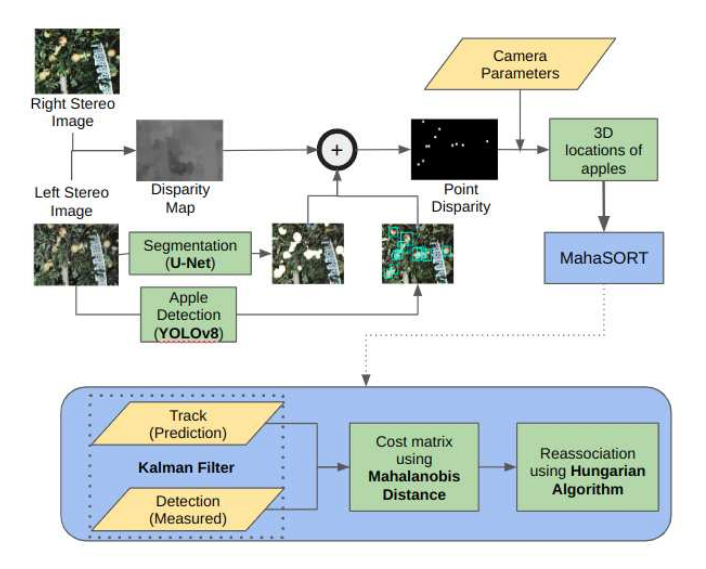

# Apple Tracking

This branch consists of the apple tracking pipeline for the apple harvesting project. The diagram below shows the process flow and the entire pipeline can be understood in detail from the [document](./docs/Report.pdf)

Kindly note that the dataset is not opensource and we have not provided dataset for the same reason

The pipeline consists of the following major components:
1. **Object detection:** Performed using YOLOv8. The code for this is present in [./deep_sort_3D/yolo_v8](./deep_sort_3D/yolo_v8). The [./deep_sort_3D/yolo_v8/pred.py](./deep_sort_3D/yolo_v8/pred.py) contains the class V8 which is used to perform object detection in the pipeline. The weights for the model have to be saved at the location `./deep_sort_3D/yolo_v8/runs/detect/train2/weights/best.pt` and the weights can be downloaded from [this link](https://drive.google.com/drive/folders/1sFemci9CUVmg45D0P46qEtFgqzgDb7WV?usp=sharing). A custom path for the model weights can be given in file run_tracker.py, line 13, py passing the model_path while making detector object.
2. **Semantic Segmentation:** Semantic segmentation is performed using U-Net segmentation network. The scripts are present in [./Segmentation](./Segmentation). A class Segmentation is present in the file [./Segmentation/predict.py](./Segmentation/predict.py), which is used to perform segmentation in the pipeline. The weights have to be stored at the location `./Segmentation/checkpoints/checkpoint_epoch21.pth` . The weights can be downloaded from [this link](https://drive.google.com/drive/folders/1SLQZ_C2akL93qqQLLdmABtkRMkxU2kXX?usp=sharing). A custom path for the model weights can be given in file run_tracker.py, line 16, py passing the model_path while making Segmentation object.
3. **Disparity:** It is used to find disparity of the left and right stereo image. The scripts for the same are present at [./Disparity](./Disparity). Class Disparity is present in the file [./Disparity/demo.py](./Disparity/demo.py), which is used to find disparity in the pipeline. The weights should be stored at the location `./Disparity/` and can be downloaded from [this link](https://drive.google.com/drive/folders/1wiNKmOERfpBoCXHKhCqRHcrs9p3JPWyU?usp=sharing). A custom path for the model weights can be given in file run_tracker.py, line 19, py passing the model_path while making Disparity object.
4. **Object Tracking:** It is performed using Mahalabis distance and Kalman Filter. The scripts to perform tracking are stored in [./deep_sort_3D](./deep_sort_3D) and [./Utils](./Utils.py). Please do not change the name of Utils.py to utils.py as it had to be done to prevent overloading.

## Running the script
The following [yaml file](./apple_tracking.yml) can be used to create the conda environment using the command `conda env create -n ENVNAME --file apple_tracking.yml`. The input to the algorithm is left and right stereo camera videos. Videos can be downloaded and should be placed at `./Videos`. The entire script can be run by using the command `python3 run_tracker.py` from the folder deep_sort_3D.

If the same system is being used, activate conda environment `aaples` using command `conda activate apples`. Following this download weights of all the models mentioned above and put them at their respective location. After the videos have been added at the respective location, execute the above mentioned command.

## Understanding dataset

The detection dataset contains left and right stereo camera frames, however, all the frames are not labelled. Only the left camera frames are labelled and the frames labelled are seen inside detections 2. Also, there is a stark difference in lighting between the segmentation and detection dataset. To have a consistent dataset, histogram equilization was used, the function for which can be seen in [Utils.py](./Utils.py) with name `match_hist()`. The orignal dataset for detection is also present in the folder.

## Saving output

The scripts saves three kinds of outputs:

1. Every frame, indicating the bounding box and fruit id. The path for the same can be given while making the object YOLOv8_SORT_3D in line 21 of `run_tracker.py` by passing the path to the variable `frame_save_dir_path`. 
2. The tracking video: The path can be given on line 23 of `run_tracker.py` by passing the path to `output` variable.
3. Point cloud: Provisions have been given in the code to store point cloud of just the fruit without the background or to store the point for each fruit. Boolean variables, `only_fruit` and `single_point` can be made true accordingly in the function `obtain_3d_volume` of [Utils.py](./Utils.py). Making both false shall save the entire point cloud. Path for saving the poitn cloud can be given to the variable `file name` of the same function.

## Sample Outputs

## Future work

1. The current FPS of the pipeline is 0.12~0.15 FPS. This is due to the large size of the images resulting in large amount of time to perform segmentation and disparity calculation. The pipeline was run by downsmapling the images, however, it resulted in poor association during tracking. Potential solution is to train all the network with downsampled images.
2. Currently, the pipeline performs object detection & segmentation and their intersection is used to get all the apples separately without any background noise. This was done because there were different datasets for object detection and segmentation. However, this is not very accurate, as multiple bounding boxes end up having the same contour. This problem can be avoided by performing instance segmentation, using one labelled dataset consisting of bounidng boxes and pixel labels.
3. To achieve better association, each segmented apple should be fitted to a sphere to get the exact location of the apple. One such related work is [frustum based method](https://www.mdpi.com/2072-4292/14/3/482) 

 

