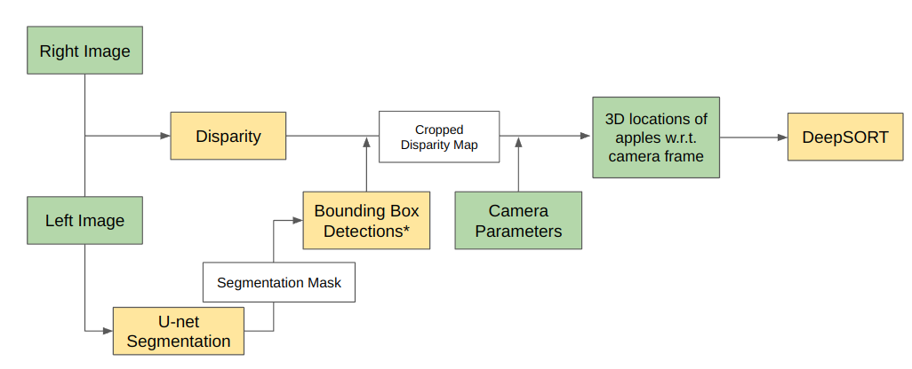
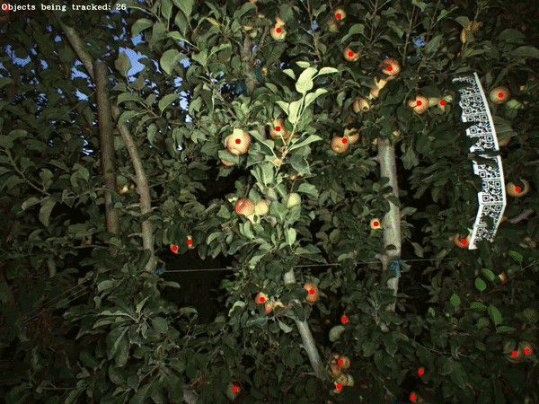

# Apple-Tracking
This repository is used for tracking apples in an orchard by using stereo camera setup. 

It has the following main components:

1. **Disparity:** Uses RAFT stereo to find disparity map
2. **Segmentation:** Employs UNet segmentation to segment out fruits from images
3. **Superglue:** Feature matching algorithm used in DeepSort
4. **DeepSORT:** Multi-object trackign algorithm

The diagram below shows the entire pipeline of how these components are used for tracking apples:

The entire pipeline can be activated by runninng `wrapper.py` by running the comment 'python3 wrapper.py'. 'wrapper.py' has the following arguments:

1. **debug**: To view and save images of each component
2. **disparity_model**: To give path of weights for RAFT stereo
3. **left**: To give path for left stereo image
4. **right**: To give path for right stereo image
5. **size**: To give downsampling image size to run RAFT stereo faster
6. **seg_mode**: To give path for weights of UNet segmentation
7. **scale**: To give downsamplign factor for segmentation
8. **match**: Bool value whether to perform histogram equilization of the inputted images with a reference (Used in cases when the lighting onditions of images used to train segmentation model is very different from the inputted images)

## Basline Results:

 
